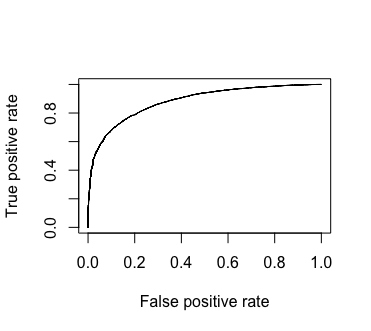

# Gradient descent algorithm

* **Data set used** : Adult data set from UCI machine learning repository.

* **Objective** : Train a logistic regression model to predict if the wage is >50 K or =< 50K USD. The traning is performed via stochastic gradient descent.

* **Features selection and normaliation** : All except fnlwgt, and education-num. The continuous variables were normalized via z-score normalization to control the norm of the feature vectors, and the categorical variables were converted to one-hot binary vector via dummy encoding. The last column of each encoding was removed to avoid multi-collinearity.

* **Measure of accuracy** : Area under the curve (AUC).

* **Algorithm** : Stochastic gradient descent.

```
Theta_{t+1} <- Theta_t - \eta x gradient (l(Theta_t;x_t,y_t))

Here l(Theta;x,y) is the logistic lossfuction with y \in {-1,1}.

\eta is the learning rate which is set to 1/\sqrt{t} after tuning.

```

* **Performance evaluation (AUC)** :
```
  AUC: 0.8812888


```


